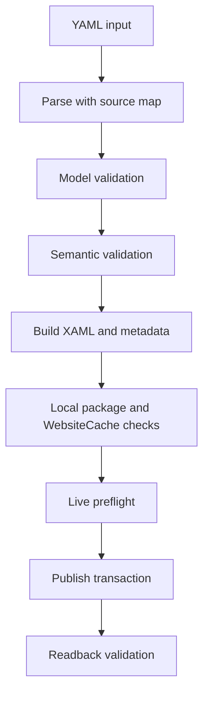

# Feedback implementation plan 2026-05-13

Related docs: [documentation index](index.md), [workflow authoring guide](workflow-authoring.md), [publishing and operations guide](publishing-and-operations.md), and [action support matrix](action-support-matrix.md).

Implementation planning is current through the 2026-05-18 feedback. The next work should stay focused on safer create/publish ergonomics and diagnostics before larger authoring features.

## Implemented foundation

1. **Action classification and release framing** - done
   - Action support classification lives in [`action-support-matrix.md`](action-support-matrix.md), with production guidance in [`README.md`](../README.md).
   - Outcome: users can distinguish stable workflows from preview, experimental, dev-only, and unsupported SharePoint activity usage.

2. **One packaged CLI entry point** - done
   - [`scripts/spnet-workflow.ps1`](../scripts/spnet-workflow.ps1) is the preferred entry point for `help`, `build`, `inspect`, `export`, `publish`, `update`, `auth-test`, and `doctor`.
   - `build`, `inspect`, `export`, and `publish` delegate through [`scripts/Invoke-SPNetYamlWorkflow.ps1`](../scripts/Invoke-SPNetYamlWorkflow.ps1); live publishing delegates through [`scripts/Invoke-SPNetWorkflow.ps1`](../scripts/Invoke-SPNetWorkflow.ps1) to the CSOM publisher at [`src/SPNet.Workflow.Publisher.Csom/Program.cs`](../src/SPNet.Workflow.Publisher.Csom/Program.cs).
   - Outcome: packaged users have one obvious command path instead of wrapper/direct-executable confusion.

3. **Package integrity, help, path handling, and auth defaults** - done
   - `doctor` performs local package/source checks, help is command-specific, user paths resolve from the caller directory, and `SPNET_ERROR [code]` output exists for local wrapper failures.
   - Publish auth modes are explicit: `WebLogin`, `CookieHeader`, `WindowsDefault`, and `Credentials`; packaged publisher discovery is package-relative first.
   - Outcome: packaging and auth-input failures are caught before live publication where possible.

## 2026-05-18 priority implementation plan

### P0 milestone 1: First-class create command

Goal: make the most common YAML workflow path a single safe command that builds artifacts and publishes exactly one intended workflow.

Command UX:

```powershell
.\scripts\spnet-workflow.ps1 create --workflow samples\workflow.example.yml --site-url https://tenant.sharepoint.com/sites/site
.\scripts\spnet-workflow.ps1 create --workflow samples\workflow.example.yml --site-url https://tenant.sharepoint.com/sites/site --dry-run
.\scripts\spnet-workflow.ps1 create --workflow samples\workflow.example.yml --site-url https://tenant.sharepoint.com/sites/site --target-type List --target-list-title Requests
.\scripts\spnet-workflow.ps1 create --workflow samples\workflow.example.yml --site-url https://tenant.sharepoint.com/sites/site --out artifacts\Requests.xaml --workflow-name RequestsApproval
```

Design:

- Add `create` to [`scripts/spnet-workflow.ps1`](../scripts/spnet-workflow.ps1) as the preferred command for YAML source. `publish` remains compatibility-focused and accepts explicit XAML. `update` remains explicit replacement.
- `create` defaults to `--if-exists Fail`, always runs build unless a future guarded import mode is introduced, and refuses ambiguous combinations such as `--no-build` with `create`.
- `create` delegates to [`scripts/Invoke-SPNetYamlWorkflow.ps1`](../scripts/Invoke-SPNetYamlWorkflow.ps1) with a new action or explicit `Create` wrapper path that performs build, validation, artifact inference, and live preflight before invoking [`scripts/Invoke-SPNetWorkflow.ps1`](../scripts/Invoke-SPNetWorkflow.ps1).
- The CSOM publisher in [`src/SPNet.Workflow.Publisher.Csom/Program.cs`](../src/SPNet.Workflow.Publisher.Csom/Program.cs) should receive a fully resolved plan: workflow name, XAML path, metadata JSON path, target type, target list identity, start options, and conflict policy.

Acceptance criteria:

- A user can run `create` with only `--workflow` and `--site-url` when the YAML contains name/target metadata and config contains cache/auth defaults.
- `create --dry-run` builds artifacts and performs offline validation, local tool resolution, and optional live preflight, but never saves, publishes, deletes, or creates subscriptions.
- Errors explain the missing inferred value and the YAML/option that can supply it.

### P0 milestone 2: Artifact path, workflow name, and target inference

Goal: infer safe defaults from YAML metadata while preserving explicit CLI overrides.

Inference order:

1. XAML output path: explicit `--out` or `--xaml`, then `artifacts/<safe effective workflow name>.xaml`, then `artifacts/<workflow file stem>.xaml` if no effective name can be parsed before full model load.
2. Metadata JSON path: explicit `--metadata-json`, otherwise `<xaml>.metadata.json` generated by build.
3. Workflow name: explicit `--workflow-name`, then YAML `metadata.displayName`, then YAML `name`, then XAML stem for legacy `publish` only.
4. Technical name: YAML `metadata.technicalName`, then YAML `technicalName`, then sanitized display/name with `.MTW` suffix.
5. Target type: explicit `--target-type`, then YAML `metadata.target.type`, then YAML `target.type`, then `Site` only after a warning for `create`.
6. Target list: explicit `--target-list-title` or `--target-list-id`, then YAML `metadata.target.listTitle`, then YAML `target.listTitle`; required when effective target type is `List`.

Implementation targets:

- Move the current scalar grep helpers in [`scripts/Invoke-SPNetYamlWorkflow.ps1`](../scripts/Invoke-SPNetYamlWorkflow.ps1) behind a single inference function. Avoid relying on regex-only parsing for final values; after build, trust the metadata sidecar generated by [`src/SPNet.Workflow.WfSerializer/WfActivityBuilderSerializer.cs`](../src/SPNet.Workflow.WfSerializer/WfActivityBuilderSerializer.cs).
- Add serializer-side helpers under [`src/SPNet.Workflow.WfSerializer/`](../src/SPNet.Workflow.WfSerializer/) for `WorkflowYaml` loading without losing metadata, safe file-name generation, and effective publish metadata calculation.
- Emit `SPNET_PLAN` JSON before publish with all inferred/explicit sources so users can see exactly what will happen.

### P0 milestone 3: Unified validation and diagnostics pipeline

Goal: turn build/publish/runtime surprises into actionable YAML-level diagnostics.

Validation stages:



Design:

- Add a diagnostic model under [`src/SPNet.Workflow.WfSerializer/`](../src/SPNet.Workflow.WfSerializer/) with fields for code, severity, message, remediation, YAML path, line, column, action index, component, and related artifact path.
- Add serializer CLI modes `validate`, `lint`, and `report` in [`src/SPNet.Workflow.WfSerializer/Program.cs`](../src/SPNet.Workflow.WfSerializer/Program.cs). The primary CLI should expose at least `validate` first and can alias `lint` later.
- Capture YamlDotNet marks during deserialization or run a pre-parse source-map pass so diagnostics can identify locations such as `stages[0].actions[3].value.valueType`.
- Standardize output prefixes: `SPNET_DIAGNOSTIC` for individual diagnostics, `SPNET_VALIDATE_RESULT` for summaries, `SPNET_PLAN` for create/dry-run plans, and keep `SPNET_RESULT` for final operation results.
- Wrapper scripts should translate known serializer/publisher errors to diagnostics instead of emitting only delegated exit codes.

Diagnostic coverage:

- Unsupported action types and preview/dev-only publish-parity warnings.
- Missing or incompatible variables, initiation parameters, action targets, HTTP response variables, DynamicValue valueType mismatches, and DateTime/string mismatch risks.
- Build failures caused by missing WebsiteCache assemblies, proxy activity type absence, raw WF language expression rejection, invalid XAML, or SharePoint Designer metadata normalization.
- Publish failures caused by missing metadata, duplicate workflow names, target-list lookup failure, auth/bootstrap failure, missing history/task lists, subscription writeback failure, and Workflow Manager validation errors.

### P0 milestone 4: Stronger live preflight and dry-run

Goal: detect live SharePoint problems before mutation.

Design:

- Extend [`scripts/Invoke-SPNetWorkflow.ps1`](../scripts/Invoke-SPNetWorkflow.ps1) and [`src/SPNet.Workflow.Publisher.Csom/Program.cs`](../src/SPNet.Workflow.Publisher.Csom/Program.cs) with a non-mutating preflight mode used by `create --dry-run` and optionally by live `create` before publish.
- Preflight checks should authenticate, load web ID/title, create `WorkflowServicesManager`, enumerate definitions/subscriptions by effective name, resolve target list by title or ID, resolve `Workflow History` and `Workflow Tasks` for list workflows, verify start options, inspect existing subscriptions for duplicates, and report operation plan.
- Distinguish `--preflight offline`, `--preflight live`, and `--preflight none` if needed, with `create` defaulting to live preflight before live publish and offline preflight in dry-run when no auth is requested.
- Preserve the existing local `auth-test` semantics but add a live auth/preflight path rather than overloading local-only `auth-test`.

### P1 milestone 5: SharePoint metadata validation and controlled truncation

Goal: prevent invalid display names, status columns, descriptions, and initiation form metadata from failing late or being silently mangled.

Design:

- Add metadata validation to `WorkflowDefinitionMetadataYaml` in [`src/SPNet.Workflow.WfSerializer/WorkflowDefinitionMetadata.cs`](../src/SPNet.Workflow.WfSerializer/WorkflowDefinitionMetadata.cs) and to publisher metadata loading in [`src/SPNet.Workflow.Publisher.Csom/Program.cs`](../src/SPNet.Workflow.Publisher.Csom/Program.cs).
- Define a policy switch: `--metadata-policy Strict|Warn|Truncate`, defaulting to `Strict` for names/targets and `Warn` or `Truncate` only for safe descriptive fields after explicit opt-in.
- Never silently truncate workflow names, technical class names, parameter names, target list titles, or field internal names. Fail with a diagnostic if a value cannot be safely accepted.
- For descriptive values such as description, display text, and form-field descriptions, allow deterministic truncation with a visible warning and optional suffix/hash so collisions and loss are auditable.
- Validate XML-invalid characters, duplicate names after normalization, reserved field names, empty choices/defaults for field types that require values, and boolean/string attributes such as `Mult`, `Sortable`, `RichTextMode`, and `Direction`.

### P1 milestone 6: Safer WF activity and property type coercion

Goal: remove unsafe `Convert.ChangeType` behavior and make type mismatches diagnostic before generated XAML reaches Workflow Manager.

Design:

- Introduce a central coercion/type service under [`src/SPNet.Workflow.WfSerializer/`](../src/SPNet.Workflow.WfSerializer/) used by [`src/SPNet.Workflow.WfSerializer/WorkflowExpressionFactory.cs`](../src/SPNet.Workflow.WfSerializer/WorkflowExpressionFactory.cs), [`src/SPNet.Workflow.WfSerializer/WorkflowActivityBuilder.cs`](../src/SPNet.Workflow.WfSerializer/WorkflowActivityBuilder.cs), [`src/SPNet.Workflow.WfSerializer/ActivityReflectionWriter.cs`](../src/SPNet.Workflow.WfSerializer/ActivityReflectionWriter.cs), and action builders under [`src/SPNet.Workflow.WfSerializer/Actions/`](../src/SPNet.Workflow.WfSerializer/Actions/).
- Support explicit, culture-invariant parsing for `String`, `Boolean`, `Int32`, `Double`, `DateTime`, `TimeSpan`, `Guid`, `DynamicValue`, and object-cast scenarios.
- Reject ambiguous coercions, such as non-ISO date strings, non-boolean strings for boolean targets, fractional values for `Int32`, object-valued fields without `valueType`, and variable references whose declared type conflicts with the destination.
- Enhance `ActivityReflectionWriter.SetProperty` to select a compatible property overload deterministically and report expected/actual types when it cannot.
- Feed coercion errors into the diagnostics pipeline with YAML paths and suggested fixes.

### P1 milestone 7: Retry, idempotency, and cleanup after failed publish

Goal: make retries after partial or failed publish safe and predictable.

Design:

- Treat publish as a transaction with phases: preflight, optional backup, save definition, metadata readback, publish definition, publish subscription, subscription readback, result write.
- Persist or emit a deterministic artifact fingerprint from YAML path, XAML hash, metadata hash, workflow name, target, and start options. Use this fingerprint in diagnostics and, where feasible, in definition/subscription property bags.
- After any exception, re-query by definition ID, workflow name, and subscription ID before retrying cleanup. Report whether rollback deleted the new definition/subscription, found nothing, or could not determine committed state.
- Add guarded retry rules for transient CSOM/network failures: retry only before mutation, or after readback proves no partial mutation occurred. Never blindly retry `SaveDefinition`, `PublishDefinition`, or `PublishSubscriptionForList` after an unknown commit without re-querying.
- Keep `IfExists Fail` as the default for `create`. `CreateNew` remains explicit side-by-side publishing. `Update` remains guarded and should require expected definition ID plus backup.

### P0/P1 milestone 8: Runtime HistoryListId exception investigation and remediation

Goal: understand and fix the runtime configuration exception where SPD2013 republish repairs `HistoryListId` but creates duplicate subscriptions.

Current hypothesis:

- List workflow subscriptions created by SPNet may not persist exactly the same subscription property bag as SPD2013. Runtime then reports missing `HistoryListId` configuration. SPD2013 republish writes the missing properties but can add a duplicate subscription instead of replacing the SPNet subscription.

Investigation design:

- Extend [`scripts/Get-SPNetWorkflowDiagnostics.ps1`](../scripts/Get-SPNetWorkflowDiagnostics.ps1), [`scripts/Invoke-SPNetWorkflow.ps1`](../scripts/Invoke-SPNetWorkflow.ps1), or a new diagnostics subcommand to export definition metadata and all subscription properties for a workflow before SPNet publish, after SPNet publish, after runtime failure, and after SPD2013 republish.
- Compare `WorkflowSubscription` public properties and `PropertyDefinitions` keys/values, especially `HistoryListId`, `TaskListId`, `EventSourceId`, `StatusFieldName`, event type keys, list identity keys, and `Microsoft.SharePoint.ActivationProperties.*` entries.
- Capture duplicate subscriptions by definition ID, name, event source, event types, and target list. Identify whether SPD creates a second subscription for the same definition or a new definition plus subscription.

Remediation design:

- During list workflow publish in both [`scripts/Invoke-SPNetWorkflow.ps1`](../scripts/Invoke-SPNetWorkflow.ps1) and [`src/SPNet.Workflow.Publisher.Csom/Program.cs`](../src/SPNet.Workflow.Publisher.Csom/Program.cs), set history/task/event-source/status properties through both public properties and property-bag fallback when the CSOM assembly shape requires it.
- After `PublishSubscriptionForList`, immediately read back the subscription and validate that `HistoryListId`, `TaskListId`, event source, target list, event types, and status field are present and match the plan. If not, fail with a diagnostic and rollback or mark remediation required.
- Add a guarded remediation command only after investigation proves the safe path. Preferred remediation is subscription-only repair or delete/recreate of the affected subscription under the same definition, not full republish and not duplicate side-by-side subscriptions.
- Add duplicate-subscription detection to preflight. If duplicates exist, `create` should fail before mutation and recommend guarded cleanup/list diagnostics rather than adding another subscription.

### P2 milestone 9: Documentation, samples, and CI hardening

Goal: make the safer command path discoverable and enforce it in tests.

- Rewrite quickstart and publish docs around `create` first, with `publish --no-build` documented as advanced.
- Add examples for inferred site workflow, inferred list workflow, explicit artifact output, dry-run/preflight, metadata-policy behavior, and guarded update.
- Split or clearly label stable versus experimental/dev-only samples under [`samples/`](../samples/).
- Add package smoke tests for `help`, `doctor`, `validate`, `build`, `create --dry-run`, metadata diagnostics, and package-relative publisher/serializer discovery.

## Test strategy

- PowerShell CLI tests: argument parsing for `create`, artifact inference, option precedence, path normalization, `--dry-run`, validation of missing workflow/site/target-list values, and delegated wrapper error mapping.
- Serializer unit tests in [`tests/SPNet.Workflow.WfSerializer.Tests/YamlWorkflowModelTests.cs`](../tests/SPNet.Workflow.WfSerializer.Tests/YamlWorkflowModelTests.cs): YAML source-map diagnostics, metadata inference, unsupported action diagnostics, type coercion, validation report content, and metadata JSON sidecar generation.
- Publisher unit tests in [`tests/SPNet.Workflow.WfSerializer.Tests/CsomPublisherMetadataTests.cs`](../tests/SPNet.Workflow.WfSerializer.Tests/CsomPublisherMetadataTests.cs): metadata policy, form-field truncation/validation, effective workflow/target resolution, safe coercion helpers, fingerprint generation, and subscription property-setting fallbacks through fake objects.
- WebsiteCache integration tests: build stable samples, inspect generated XAML, ensure diagnostics for missing proxy activity types, and verify generated metadata uses SharePoint Designer-compatible shapes.
- Live SharePoint test plan: preflight against a test site, create site workflow, create list workflow, retry after simulated/observed failures, duplicate-name refusal, guarded update with expected ID, duplicate subscription detection, HistoryListId readback validation, and controlled cleanup.

## Key risks and mitigations

- **Legacy CSOM shape variance**: farms and local assemblies may expose different WorkflowServices APIs. Mitigate with reflection-based property setters plus readback diagnostics and tests with fake/public-property/property-bag-only objects.
- **Dry-run expectations**: users may expect no authentication during dry-run. Mitigate by documenting offline versus live preflight and showing whether live authentication occurred in `SPNET_PLAN`.
- **Metadata truncation data loss**: silent truncation can create wrong workflows. Mitigate with strict defaults, explicit opt-in, deterministic warnings, and no truncation for identifiers.
- **Retry after unknown commit**: blind retries can duplicate definitions/subscriptions. Mitigate by re-querying before any retry and failing closed when commit state cannot be proven.
- **HistoryListId repair uncertainty**: changing subscription property writes may not fully match SPD2013. Mitigate by first collecting before/after diagnostics and only shipping automated repair after the subscription delta is known.

## Later authoring-power releases

1. **JSON helper actions**
   - Add safer high-level helpers such as parse JSON, typed get string/number/boolean/date, has property, count, any, where/find where feasible, and distinct/grouping only if they can map safely to supported runtime activities.
   - Build on DynamicValue safety and linter infrastructure first.

2. **Date actions**
   - Add or promote parse date, add days, compare dates, format date, week start/end, and date range helpers.
   - Keep actions experimental until publish/runtime/export behavior is verified.

3. **HTML/email templating and escaping**
   - Add build-time template inclusion and named placeholder substitution.
   - Add escaping modes for HTML text, HTML attribute, URL, and raw-with-warning.
   - Add lint warnings for unescaped SharePoint text/DynamicValue insertion into HTML email.

## Recommended implementation order

1. Add `create` command UX, artifact/name/target inference, and plan output.
2. Add unified validation/diagnostics foundation with YAML source locations.
3. Add local and live preflight paths and wire them into `create --dry-run` and live `create`.
4. Harden metadata validation/truncation policy and safe type coercion.
5. Harden publisher transaction, rollback, retry, idempotency, and readback validation.
6. Investigate HistoryListId by capturing SPNet versus SPD2013 subscription property deltas.
7. Implement guarded HistoryListId subscription repair only after the delta is proven.
8. Update docs/samples and add package smoke tests around the `create` path.
9. Defer JSON/date/template helpers until the stabilisation foundation is shipped.

This plan prioritises packaging reliability, command ergonomics, validation before publish, safe retry/idempotency, and runtime subscription correctness before adding larger workflow-authoring features.
